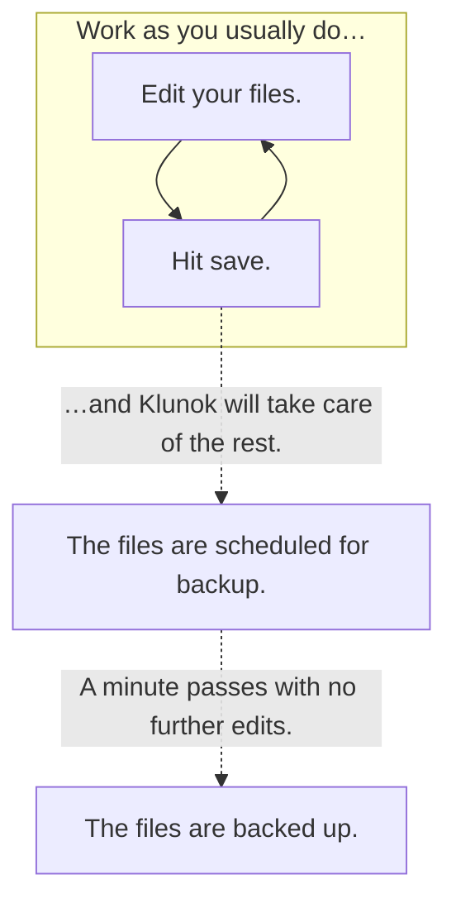

import Logo from '../static/logo.svg';

# <Logo alt="" height="100%" width="2em" style={{verticalAlign: "middle"}} /> Klunok

<head>
  <title>Klunok</title>
</head>

Klunok is a smart versioning and automatic backup daemon for Linux.
It keeps a versioned history of files that you edit,
doing so in the background without any effort required from you.
It picks up everything that matters (sources, …) and nothing that doesn't (binaries, …)
automatically.

Klunok works well with most text and graphics editors, IDEs, and office suites,
including Vim, Visual Studio Code, LibreOffice, and Inkscape.
Also, Klunok is free and open source: https://github.com/Kharacternyk/klunok.

